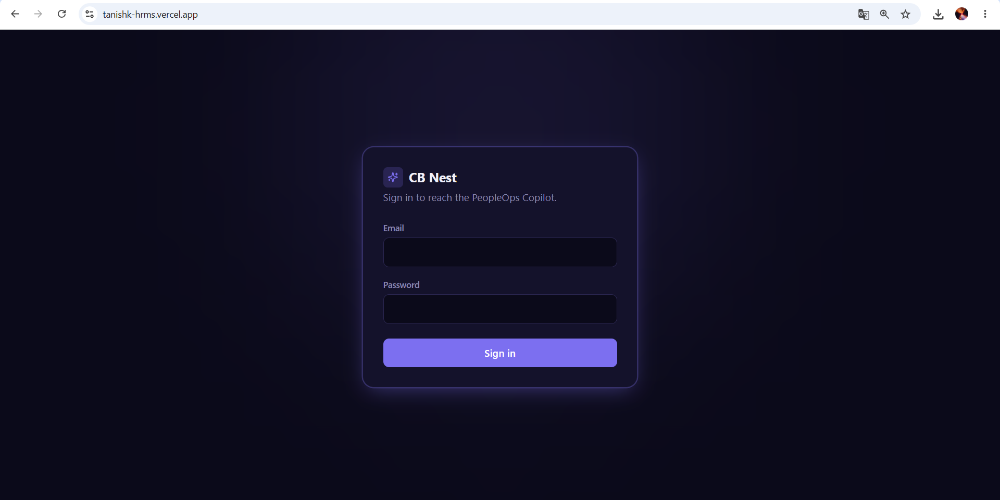
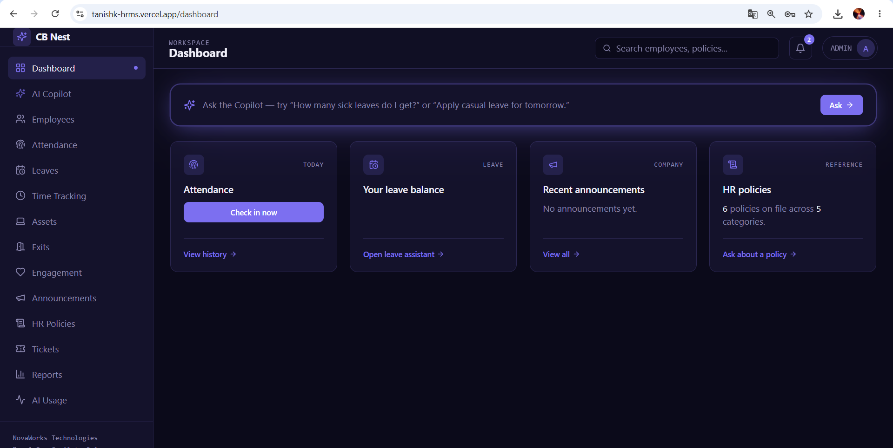
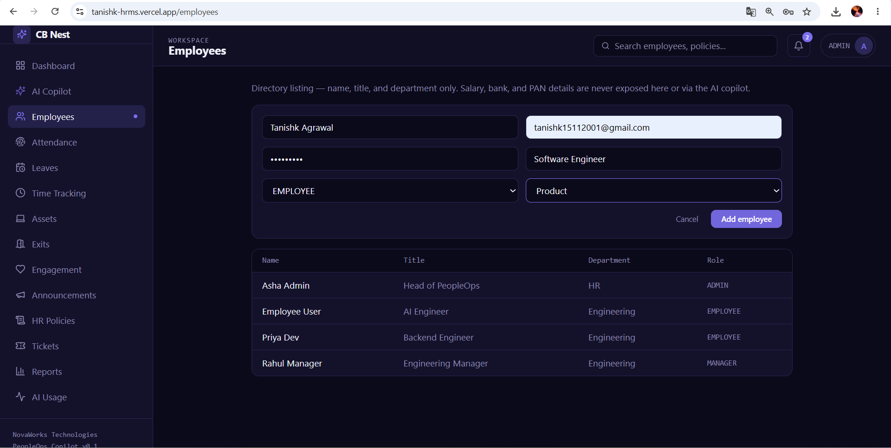
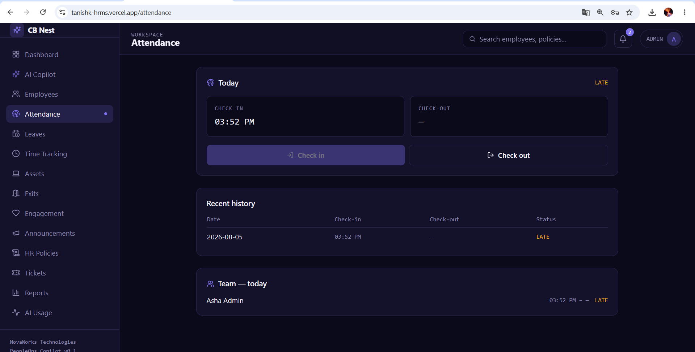
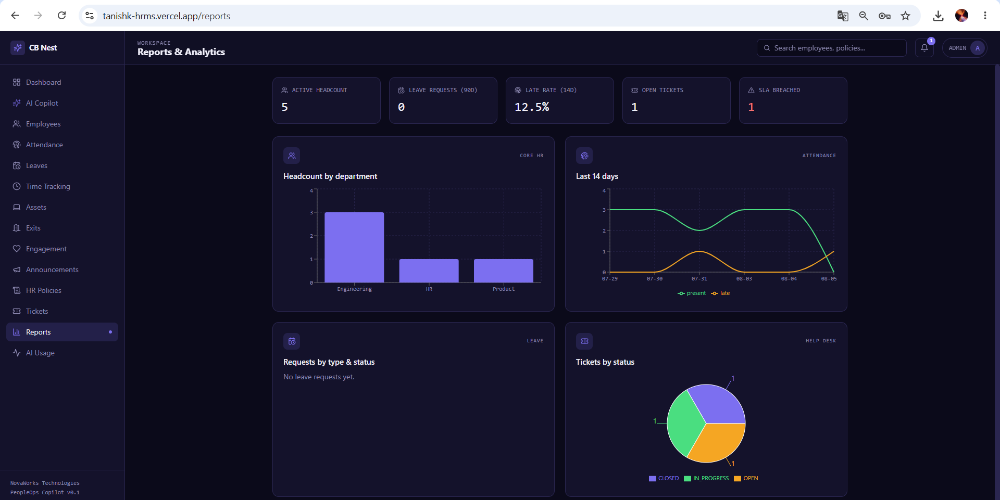
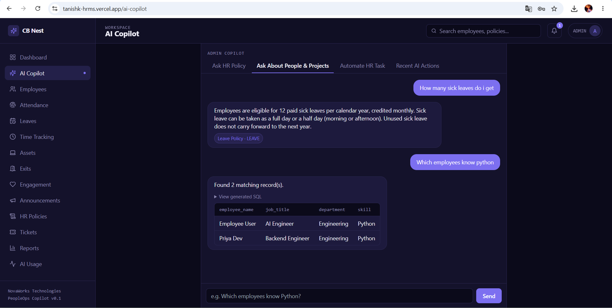

# 🚀 CB Nest – NovaWorks PeopleOps Copilot

> AI-powered Human Resource Management System (HRMS) built with **React + FastAPI + PostgreSQL**, featuring secure HR workflows, role-based access control, reporting, and an AI-powered HR Copilot.

---

# 📌 Overview

CB Nest is a full-stack Human Resource Management System designed to digitize and automate HR operations within an organization.

The system centralizes employee management, attendance tracking, leave management, asset allocation, exit workflows, employee engagement, time tracking, help desk tickets, company policies, announcements, reporting, and AI-assisted HR operations in a single platform.

The project follows a modern layered architecture using React for the frontend and FastAPI for backend services.

---

# ✨ Core Features

## 🔐 Authentication & Security

- Secure Login
- Role-Based Access Control (RBAC)
- Protected API Endpoints
- JWT Authentication
- Backend Permission Validation

---

## 👨‍💼 Employee Management

- Employee Directory
- Employee Profiles
- Departments
- Designations
- CRUD Operations

---

## 🕒 Attendance Management

- Attendance Records
- Attendance Tracking
- Attendance Reports

---

## 📝 Leave Management

- Apply Leave
- Approve / Reject Leave
- Leave Status Tracking

---

## 💻 Asset Management

- Asset Inventory
- Asset Assignment
- Asset Return Tracking

---

## 🚪 Exit Management

- Exit Requests
- Exit Workflow
- Clearance Tracking

---

## 🎯 Employee Engagement

- Employee Engagement Records
- Activity Tracking

---

## ⏱ Time Tracking

- Time Entry Management
- Work Log Tracking

---

## 🎫 Help Desk

- HR Support Tickets
- Ticket Categories
- Ticket Comments
- SLA Tracking

---

## 📢 Announcements

- Organization Announcements
- Company Updates

---

## 📚 Company Policies

- HR Policies
- Employee Guidelines

---

## 📊 Reports

- Attendance Reports
- Leave Reports
- Employee Reports
- HR Analytics

---

## 🤖 AI PeopleOps Copilot

- HR Policy Question Answering
- Secure Information Retrieval
- AI-assisted HR Operations
- Audit Logging
- Permission-aware AI Actions

---

# 🏗 Architecture

```text
                    React Frontend
                           │
                           │ REST APIs
                           ▼
                    FastAPI Backend
                           │
      Authentication • Authorization • Validation
                           │
                   Business Logic Layer
                           │
                    SQLAlchemy ORM
                           │
                      PostgreSQL
                           │
               AI Services & Audit Logs
```

---

# 🛠 Tech Stack

## Frontend

- React
- JavaScript
- React Router
- Axios
- CSS

## Backend

- FastAPI
- Python

## Database

- PostgreSQL
- SQLAlchemy ORM
- Alembic

## AI

- OpenAI Integration
- Embeddings
- Action Agent
- Permission-aware AI APIs
- Audit Logging

## Deployment

- Frontend: Vercel

---

# 📂 Repository Structure

```text
backend/
│
├── alembic/
├── app/
│   ├── api/
│   │   └── v1/
│   │       └── endpoints/
│   ├── core/
│   ├── db/
│   ├── models/
│   ├── schemas/
│   ├── services/
│   │   └── ai/
│   ├── seed_data.py
│   └── main.py
│
frontend/
│
├── src/
│   ├── components/
│   ├── pages/
│   ├── services/
│   ├── hooks/
│   └── utils/
```

---

# ⚙ Installation

## Clone Repository

```bash
git clone https://github.com/Tanishk2001/TanishkHRMS.git

cd TanishkHRMS
```

---

## Backend

```bash
cd backend

pip install -r requirements.txt

alembic upgrade head

uvicorn app.main:app --reload
```

---

## Frontend

```bash
cd frontend

npm install

npm run dev
```

---

# 📚 API Documentation

FastAPI automatically generates Swagger documentation.

Open:

```
http://localhost:8000/docs
```

---

# 🔒 Security

The application implements multiple security mechanisms.

- JWT Authentication
- Role-Based Access Control
- Backend Permission Validation
- SQLAlchemy ORM (prevents raw SQL construction in ORM usage)
- Request Validation using Pydantic Schemas
- AI Permission Enforcement
- AI Audit Logs

---

# 🤖 AI Workflow

```text
User

↓

React Frontend

↓

FastAPI Chat Endpoint

↓

LLM Client

↓

Permission Layer

↓

API Tools / SQL Retrieval

↓

Audit Logging

↓

Response
```

The AI assistant never bypasses backend validation. Sensitive operations are routed through backend APIs where authentication, authorization, validation, and audit logging are enforced.

---

# 🔄 End-to-End Flow

1. User Login
2. Authentication
3. Dashboard Access
4. Employee Management
5. Attendance Tracking
6. Leave Request
7. Manager Approval
8. Report Generation
9. AI Assistance

---

# 📸 Screenshots


## Login



---

## Dashboard



---

## Employee Management



---

## Attendance



---

## Reports



---

## AI Copilot



---

# 🎥 Demo Video

Demo Video:

**(Add YouTube / Google Drive Link)**

---

# 🚧 Known Limitations

- Payroll module is not included.
- Mobile application is not available.
- Email notifications can be expanded.
- Advanced HR analytics can be enhanced.

---

# 🚀 Future Improvements

- Payroll Management
- Email Notifications
- Calendar Integration
- Mobile Application
- AI Resume Screening
- AI Interview Scheduling
- Advanced Analytics Dashboard
- Multi-tenant Support

---

# 💡 Design Decisions

- React was chosen for reusable component-based UI development.
- FastAPI provides high-performance REST APIs with automatic OpenAPI documentation.
- SQLAlchemy simplifies secure ORM-based database interactions.
- Alembic manages version-controlled database migrations.
- AI operations are executed through backend services with permission checks and audit logging rather than direct database access.

---

# 👨‍💻 Author

**Tanishk Agrawal**

GitHub: https://github.com/Tanishk2001

---

## ⭐ If you found this project useful, consider giving it a star!
