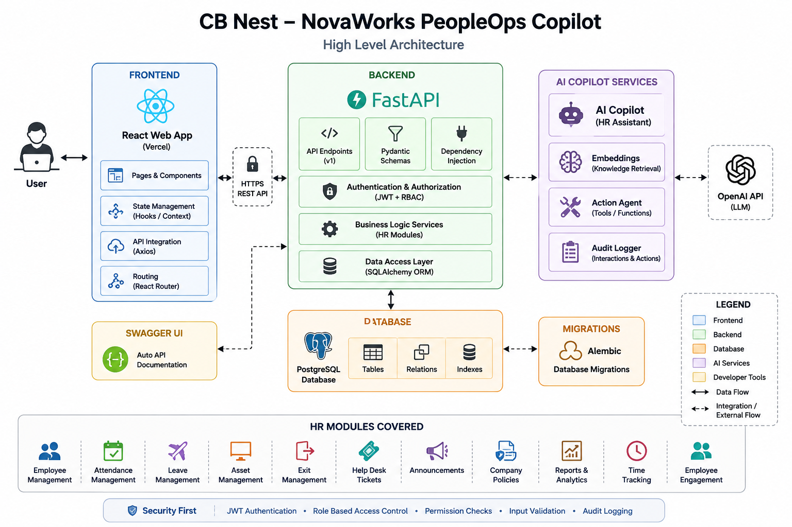

# 🏗 AI Architecture – NovaWorks PeopleOps Copilot

## Overview

The AI Copilot extends the existing HRMS without bypassing its business logic. Every AI request follows the same authentication, authorization, and validation pipeline as the web application.

The AI never writes directly to the database. Read operations use guarded SQL queries, while write operations are executed only through existing backend APIs.

---

# Architecture



---

# High-Level Flow

```text
React Frontend
        │
        ▼
FastAPI Chat APIs
        │
JWT Authentication
        │
Role-Based Access Control
        │
Intent Router
        │
 ┌────────────┬────────────┬────────────┐
 │            │            │
 ▼            ▼            ▼
Policy     SQL Agent   Action Agent
Assistant
 │            │            │
 ▼            ▼            ▼
TF-IDF     Read-only     Existing
Retriever  SQL           Backend APIs
 │            │            │
 └────────────┴────────────┘
              │
              ▼
        PostgreSQL Database
              │
              ▼
         Audit Logging
```

---

# Design Principles

- **Security First** – Every request is authenticated and authorized.
- **Reuse Existing APIs** – AI uses existing backend endpoints instead of bypassing business logic.
- **Least Privilege** – Access is controlled using role-based permissions.
- **Offline Support** – Core functionality works without external AI services.
- **Modular Design** – Each AI capability is implemented as an independent service.

---

# AI Components

| Component | Responsibility |
|-----------|----------------|
| Policy Assistant | Answers HR policy questions |
| SQL Agent | Executes safe read-only SQL queries |
| Action Agent | Automates HR workflows through backend APIs |
| AI Router | Routes requests to the appropriate agent |
| Permissions | Centralized RBAC for all AI actions |
| Audit Logger | Records AI requests and outcomes |

---

# Policy Assistant

The Policy Assistant retrieves information from company HR policies using a local TF-IDF retrieval system.

### Features

- Paragraph-based document chunking
- TF-IDF similarity search
- Configurable Top-K retrieval
- Optional LLM response generation
- Offline extractive fallback
- Prompt injection protection

The assistant only answers using retrieved policy content and refuses to guess when sufficient context is unavailable.

---

# SQL Agent

The SQL Agent converts natural language into safe read-only SQL queries.

### Security Features

- Read-only SELECT queries only
- Parameterized SQL templates
- SQL parsing and validation
- Table allow-list
- Sensitive column protection
- Automatic row limits
- Role-based row filtering

Employees and Managers use predefined templates, while optional admin queries are validated before execution.

---

# Action Agent

The Action Agent performs HR operations through existing backend APIs instead of writing directly to the database.

Supported actions include:

- Leave requests
- Ticket creation
- Announcements
- Project assignments
- Leave approvals

High-impact operations require user confirmation before execution.

Every action uses the authenticated user's JWT and follows the same business validation as the web application.

---

# Authentication & Authorization

Every request follows this sequence:

```text
JWT Authentication
        │
Role Validation
        │
Permission Check
        │
Intent Processing
        │
Business Rules
        │
Audit Logging
        │
Response
```

Authorization is enforced twice:

1. AI permission layer
2. Existing backend endpoints

This prevents the AI from bypassing application security.

---

# Audit Logging

Every AI interaction is recorded with:

- User ID
- Role
- Intent
- Invoked tool/API
- Request status
- Response latency

Sensitive information such as passwords, tokens, bank details, and personal identifiers is never stored.

---

# Technology Stack

## Frontend

- React
- Next.js
- TypeScript

## Backend

- FastAPI
- SQLAlchemy
- Pydantic
- Alembic

## Database

- PostgreSQL

## Authentication

- JWT
- Role-Based Access Control (RBAC)

## AI

- TF-IDF Retrieval
- Optional Anthropic Claude Integration
- Read-only SQL Agent
- Prompt Injection Protection

---

# Security Decisions

The AI layer was designed with security as the primary goal.

- No direct database writes
- Read-only SQL execution
- Existing backend APIs handle all modifications
- Centralized RBAC
- SQL Guardrails
- Prompt Injection Protection
- Audit Logging
- Server-side authorization

---

# Database Management

Database schema changes are managed using Alembic migrations.

Application data is seeded independently of schema creation, allowing safe database upgrades without recreating tables.

---

# Setup

## Backend

```bash
cd backend
pip install -r requirements.txt
alembic upgrade head
python -m app.seed_data
uvicorn app.main:app --reload
```

## Frontend

```bash
cd frontend
npm install
npm run dev
```

---

# Environment Variables

| Variable | Purpose |
|----------|----------|
| JWT_SECRET | JWT signing secret |
| DATABASE_URL | Database connection |
| ANTHROPIC_API_KEY | Optional LLM integration |
| LLM_MODEL | AI model selection |
| SQL_AGENT_MAX_ROWS | SQL row limit |
| POLICY_TOP_K | Retrieved policy chunks |
| POLICY_MIN_SIMILARITY | Minimum retrieval threshold |

---

# Testing

The backend includes automated tests covering:

- Policy Retrieval
- SQL Guardrails
- SQL Agent
- Action Agent
- Permission Validation
- Prompt Injection Protection
- API Integration

CI automatically runs backend tests and frontend build validation.

---

# Known Limitations

- TF-IDF retrieval is lexical rather than semantic.
- Employee and Manager SQL queries use predefined templates.
- Streaming responses are not implemented.
- Conversation memory is not supported.

These design choices prioritize security, simplicity, and offline execution.

---

# Future Enhancements

Potential future improvements include:

- Semantic vector embeddings
- Streaming AI responses
- Multi-agent orchestration
- Conversation memory
- Hybrid retrieval
- Observability and tracing
- AI performance analytics

---

# Summary

The AI Copilot extends the existing HRMS while preserving its security model.

Rather than bypassing application logic, it acts as another authenticated client that:

- Answers HR policy questions
- Retrieves HR information safely
- Automates HR workflows
- Enforces RBAC
- Reuses existing business logic
- Protects sensitive data
- Records all AI activity through audit logs

This architecture provides a secure, modular, and production-inspired foundation for integrating AI into enterprise HR systems.
